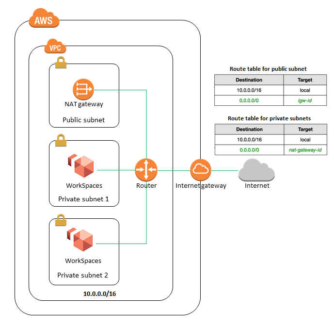

# [ NGINX API Gateway ] - ECS FARGATE Autoscaling




# FINALIDADE DO PROJETO

Projeto desenvolvido para automatizar a infraestrutura de uma solução de API Gateway resiliente, auto-escalável e utilizando de tecnologias 100% como serviço na AWS Cloud.

### A STACK CONSISTE EM IMPLEMENTAR

1.  [VPC](terraform/network.tf "VPC")
2.  [SUBNET](terraform/network.tf "SUBNET")
3.  [SG](terraform/security.tf "SG")
4.  [IGW](terraform/network.tf "IGW")
5.  [RT](terraform/network.tf "RT")
6.  [EIP](terraform/network.tf "EIP")
7.  [NGW](terraform/network.tf "NGW")
8.  [ECR](terraform/ecr.tf "ECR")
9.  [ECS](terraform/ecs.tf "ECS")
10. [IAM](terraform/iam.tf "IAM")

# PRÉ REQUISITOS

### Preparando o ambiente:
1. [Instalando Terraform](https://learn.hashicorp.com/tutorials/terraform/install-cli#overview)
2. [Instalando AWS CLI](https://docs.aws.amazon.com/pt_br/cli/latest/userguide/install-cliv2.html#overview)
Para configurar o aws-cli com este usuário, siga o `how-to` disponivel em: [Configurando AWS CLI](https://docs.aws.amazon.com/pt_br/cli/latest/userguide/cli-configure-quickstart.html#overview)
3. [Configurando Terraform Cloud](https://www.terraform.io/docs/cli/config/config-file.html#overview)
Para configurar o tf-cloud faz-se necessário cadastrar um usuário em: [Sing up](https://app.terraform.io/signup/account#overview)
4. [Terraform Documentation](https://www.terraform.io/docs/index.html#overview)

### Permissões necessárias para terraform-user:
Para garantir que seu Terraform consiga realizar a criação de todos recursos contidos neste projeto, recomendo a criação de um User (exemplo `terraform-user`), garanta que ele possua as seguintes permissões, do contrário, permita apenas acesso aos resources que deseja provisionar.

```
{
    "Version": "2012-10-17",
    "Statement": [
        {
            "Sid": "AllowSpecifics",
            "Action": [
                "ec2:*",
                "rds:*",
                "s3:*",
                "sns:*",
                "sqs:*",
                "iam:*",
                "elasticloadbalancing:*",
                "autoscaling:*",
                "cloudwatch:*",
                "cloudfront:*",
                "route53:*",
                "ecr:*",
                "logs:*",
                "ecs:*",
                "application-autoscaling:*",
                "logs:*",
                "events:*",
                "elasticache:*",
                "es:*",
                "kms:*",
                "dynamodb:*"
            ],
            "Effect": "Allow",
            "Resource": "*"
        },
        {
            "Sid": "DenySpecifics",
            "Action": [
                "iam:*User*",
                "iam:*Login*",
                "iam:*Group*",
                "iam:*Provider*",
                "aws-portal:*",
                "budgets:*",
                "config:*",
                "directconnect:*",
                "aws-marketplace:*",
                "aws-marketplace-management:*",
                "ec2:*ReservedInstances*"
            ],
            "Effect": "Deny",
            "Resource": "*"
        }
    ]
}
```

### Estrutura do projeto

```
.
├── app
│   ├── Dockerfile
│   └── proxy.conf
├── img
│   └── cover.png
└── terraform
    ├── alb.tf
    ├── autoscaling.tf
    ├── deploy.sh
    ├── destroy.sh
    ├── dev
    │   ├── backend.hcl
    │   ├── template-container-definition.json
    │   └── terraform.tfvars
    ├── ecr.tf
    ├── ecs.tf
    ├── iam.tf
    ├── locals.tf
    ├── logs.tf
    ├── main.tf
    ├── network.tf
    ├── outputs.tf
    ├── prod
    │   ├── backend.hcl
    │   ├── template-container-definition.json
    │   └── terraform.tfvars
    ├── security.tf
    └── variables.tf
```

### Conteúdo do container

A criação do container é relativamente simples, subimos uma imagm base `NGINX:LATEST`, removemos as configurações default do nginx e aplicamos uma configuração previa para realizar o redirecionamento com o método `return 301` da `request_uri` redirecionando da URI: `mlm189580.categories.meli.api.slashicorp.com.br` para API: `api.mercadolibre.com/categories/MLM189580`
Configurações contidas no path `app`.
Realizamos o push da imagem para o `ECR` em tempo de execução e aplicamos a mesma ao `ECS`.

### Preparando Environment do TF-CLOUD

Para iniciar o projeto, é necessário definir o backend.hcl (`Hashicorp Language`), para os ambientes de `DEV` e `PRD` contidos no path `terraform` do pojeto, altere a organização e o workspaces que deseja armazenar e/ou executar seu state em https://app.terraform.io.
Caso queira mais informações acesse sobre como utilizar a workspace `default`: [CLI-driven runs](https://app.terraform.io/app/slashicorp/workspaces/default/runs#overview)

### Tornando seus scripts executáveis

Para executar todo o procedimento para construir ou destruir os resources basta executar os scripts `deploy.sh` e `destroy.sh` no path `terraform`. 
Torne eles executáveis para o sistema aplicando o seguinte comando:

```
$ chmod +x deploy.sh && chmod +x destroy.sh
```

### Executando o DEPLOY dos resources

Para mudar de ambiente altere a variavel `ENV` no arquivo, default é `DEV`.

```
$ cd terraform
$ bash ./deploy.sh
```

### Executando o DESTROY dos resources

Para mudar de ambiente altere a variavel `ENV` no arquivo, default é `DEV`.

```
$ cd terraform
$ bash ./destroy.sh
```